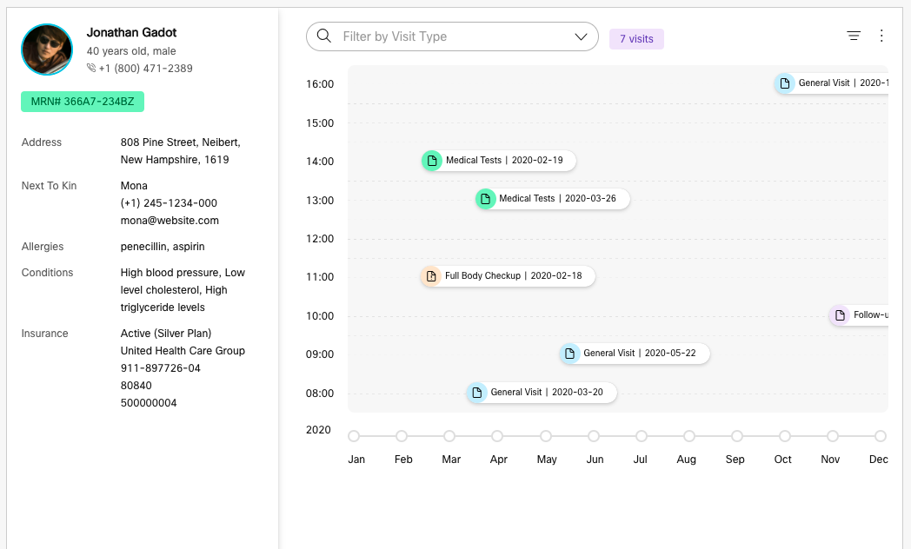

# WCC Widget Starter: Lit Element

## Development

Setting up your development environment:

1. Clone this repo
2. Run `yarn` from the root of the repo.
3. Run `yarn start` to start the playground app.

This widget is configured for demonstration purposes. For production usage, make edits according to the shape of your customer data for accurate results. 

The `./customer-data/mock-customer` file represents a demo customer info object that is imported directly into the widget.

As it currently exists, no additional API keys are needed to demonstrate this widget.

the `<customer-summary>` component's table is composable, simple add the table or table generating code needed between the tags and it will render within. Please note that the class names for "label" and "value" help the styles render correctly, like so: `<td class="title">`.

