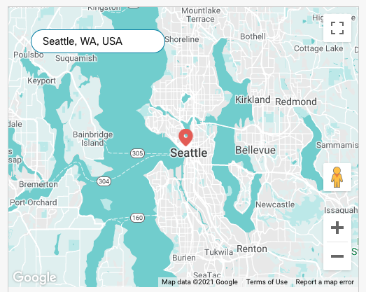

# WCC Widget Starter: Lit Element
## Development

Setting up your development environment:

1. Clone this repo
2. Run `yarn` from the root of the repo.
3. Run `yarn start` to start the playground app.

To get a Google Maps API Key:
1. Go to https://developers.google.com/maps/documentation/javascript/get-api-key for setup instructions
2. Activate both the Maps JavaScript API and the Places API for full operability.

