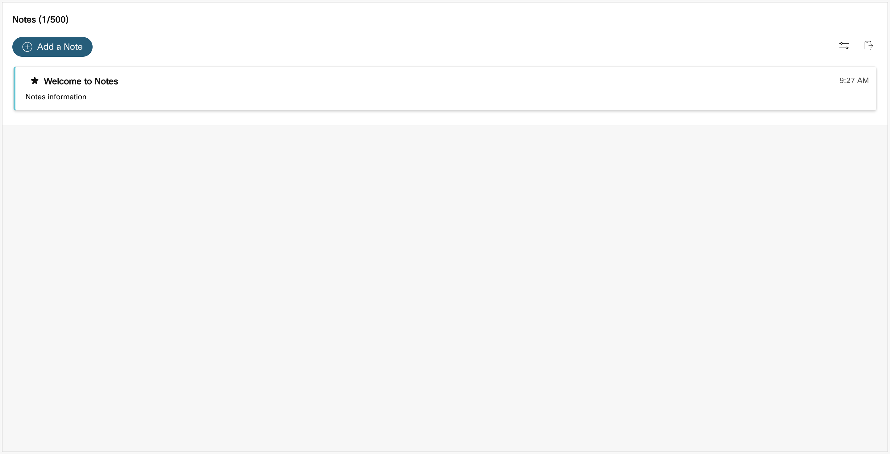

# WCC Notes Starter: Lit Element

## Development

Setting up your development environment:

1. Clone this repo
2. Run `yarn` from the root of the repo.
3. Run `yarn start` to start the playground app.

This widget is configured for demonstration purposes. For production usage, make edits according to the shape of your customer data for accurate results. 

