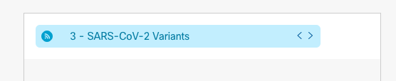

# WCC Widget Starter: Lit Element
## Development

Setting up your development environment:

1. Clone this repo
2. Run `yarn` from the root of the repo.
3. Run `yarn start` to start the playground app.

To use the RSS Feed Widget, add a URL src link to an XML RSS feed in the 'rss-feed' attribute.

