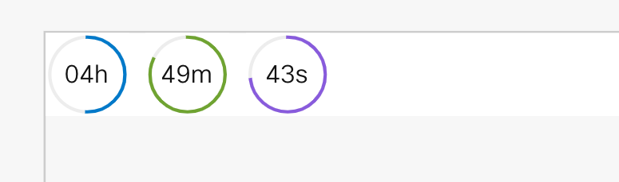

# WCC Widget: Timer

Testing in development environment:

1. Clone this repo
2. Run `yarn` from the root of the repo.
3. Run `yarn start` to start the playground app.

To use the Timer Widget:

1. Pass a time to the `duration` attribute following the string format: "hh:mm:ss".
2. Toggle the boolean attribute `paused` ro stop and start the timer.

The time remaining will persist in the browser's `localstorage`. To change, update or reset the timer, use the widget's public method `setTime(time:string):void` and pass it a string in the format "hh:mm:ss"

NOTE: Changing the `duration` attribute will reset the timer beginning at the new time.

