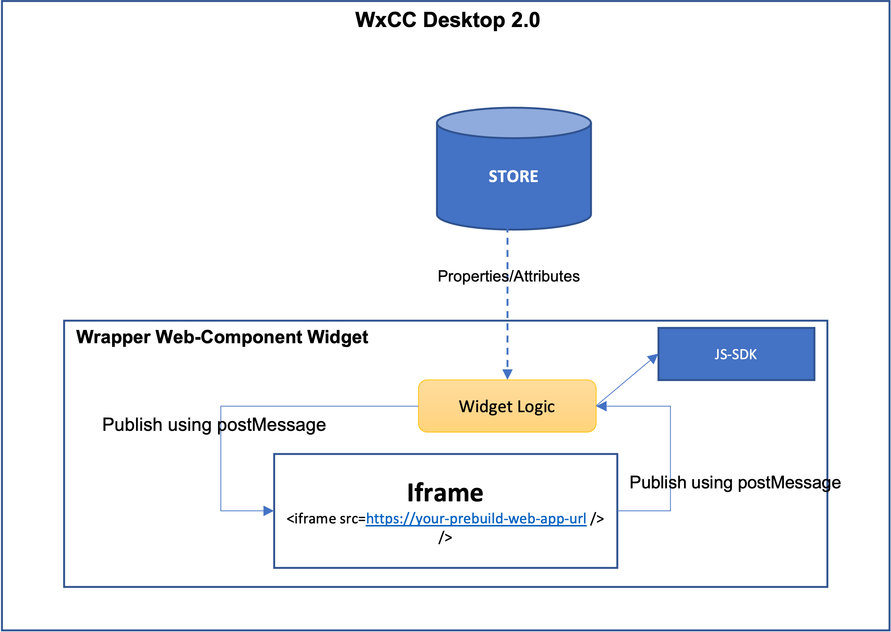

# 🚀 WXCC Widget Starter: Prebuild App Widget Example

[](https://shields.io/)
This widget starter kit demonstrates how to build an iframe-based WXCC desktop widget. The purpose of this example is to allow you to reuse your existing web application while also leveraging the WXCC desktop's shared data (i.e., the STORE) and JS-SDK API. Regardless of whether the widget is a Web Component or an IFrame, the following fundamental principles should be followed.

- Widget should should support Light/Dark Mode
- Widget should support accessibility and compliant with WCAG 2.1
- Widget Should be responsive
- Widget should follow [momentum design approach](https://momentum-design.github.io/momentum-ui/?path=/story/components-accordion--accordion)
- Widget should be light weight

## Development

### Getting started

1. [Clone Webex Contact widget starter](https://github.com/CiscoDevNet/webex-contact-center-widget-starter.git) repo.
2. Navigate to th Examples/Widgets/prebuild-app-widget starter folder.
3. Run `yarn` from the root of the repo.
4. Run `yarn start` to start the playground (sandbox) app.

### Editing widget

The example is built using vanilla JS web components. However, you can use any framework to build the web component.
The iframe is rendered by the browser as a separate child window that is outside of the parent DOM. As a result, assets or data/objects cannot be directly shared with the iframe or accessed by the iframe from the parent, especially if the iframe app is hosted on a different domain.
To address this, if an iframe-based widget wants to access desktop store data and leverage the JS-SDK, it should create a wrapper web component (e.g., ./src/PrebuildAppWrapper.js) and create an iframe inside the wrapper web component. The wrapper component will then act as a mediator between the desktop and the iframe widget.
The wrapper widget should subscribe to store data as attributes/properties from the store and publish shared data to the iframe-based widget using the browser's [postMessage](https://developer.mozilla.org/en-US/docs/Web/API/Window/postMessage) method.



### Building/exporting widget

Once you are ready to export your widget, all you need is to run the following command in Terminal (Command line tool):

```
yarn build
```

This will create a `dist` folder in the root directory of your widget with a single `prebuild-app.js` (you can also rename bundle name from webpack.config.file) file that contains your entire widget. This file can be renamed and uploaded to a preferred location on a CDN (e.g. an S3 bucket on AWS. Please keep in mind tht this file has to be publicly available over the internet to be accessible to Agent or Supervisor Desktop).

### Sharing widget information with Agent/Supervisor Desktop administrator

To be able to place your custom widget within Agent/Supervisor Desktop, Contact Center administrator will need three pieces of information:

1. The URL to the `***.js` file that you had previously generated and placed on a CDN.
2. Information regarding any properties/attributes that are required to be set for the widget to function (e.g. for Maps widget in th Examples folder, one will require to pass Google Maps API key to an `api-key` attribute).

   If you require dynamic data from Agent/Supervisor Desktop, you might want to either request it though [`wxcc-js-sdk`](https://developer.webex-cx.com/documentation/guides/desktop/#javascript-sdk) methods within your widget, or through properties - when the list of [Data Providers](https://developer.webex-cx.com/documentation/guides/desktop/#custom-widgets) contains the required information.

3. A quick preview/screenshot or the aspect ratio that is optimal for this widget. This way, an administrator will be able to make the best decision while placing it on the Desktop layout.

### Placing Widget in JSON layout

**Reference**: [Desktop Layout Reference guide for Administrator](https://www.cisco.com/c/en/us/td/docs/voice_ip_comm/cust_contact/contact_center/webexcc/SetupandAdministrationGuide_2/b_mp-release-2/b_cc-release-2_chapter_011.html#topic_8230815F4023699032326F948C3F1495).

In case you are an administrator for Contact Center Agent Desktop or are working with an administrator, you might be trying to place this component in a JSON layout specification file to test in your Contact Center environment.

This specific Widget Starter is designed to be places in a ["panel"](https://www.cisco.com/c/en/us/td/docs/voice_ip_comm/cust_contact/contact_center/webexcc/SetupandAdministrationGuide_2/b_mp-release-2/b_cc-release-2_chapter_011.html#Cisco_Generic_Topic.dita_1ae68ee3-0948-47ad-a04d-ae182dae573e) area of JSON layout specification. This is due to this widget relying on a task-specific information with the reference derived from the current location/address bar value.

**NOTE**: If you place this widget in another area in JSON layout specification ("header" or a custom page in "navigation"), some task-specific function might not work. This is to be expected.

Please feel free to reach out to your partner or Cisco directly with any additional questions.
